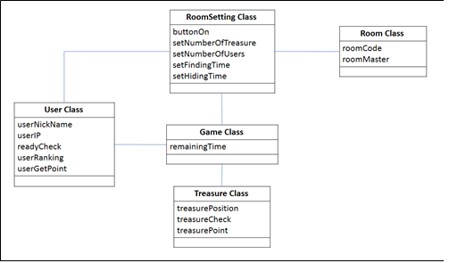

# Treasure - Hunter Game
__충북대학교 오픈소스 개발 프로젝트__ 
__produced by JavaYong team__  

프로젝트 주제
===

__‘ AR 기능을 활용한 보물찾기 안드로이드 어플 ’__

AR은 4차 산업혁명의 키워드 중 하나로 각광받고 있는 분야이다. 처음에 GitHub 사이트를 찾아보던 도중 AR core라는 구글 AR 오픈소스 속 Cloud Anchor를 보고 팀원들간의 공통 관심사도 AR이었기 때문에 AR을 메인 주제로 정했다.  

또한 팀원들이 공통적으로 어렸을 때 ‘보물찾기’ 게임을 즐겨했던 경험이 있어서 AR 기술과 보물찾기 컨텐츠를 접목시켜서 프로젝트를 진행하기로 했다.  

안드로이드 : AR을 구현하기 위해서는 카메라가 불가피한 요소이고 사용자가 손쉽게 우리의 프로그램을 사용할 수 있도록 안드로이드로 서비스를 만들기로 결정했다.  

Java 서버, DB : 다수의 사용자들에게도 할 수있는 서비스를 만들기 DB 서버가 필요 제공, JAVA와 Firebase DB를 구현하기로 했다.

클래스 다이어그램
===

=======

화면설계
===

